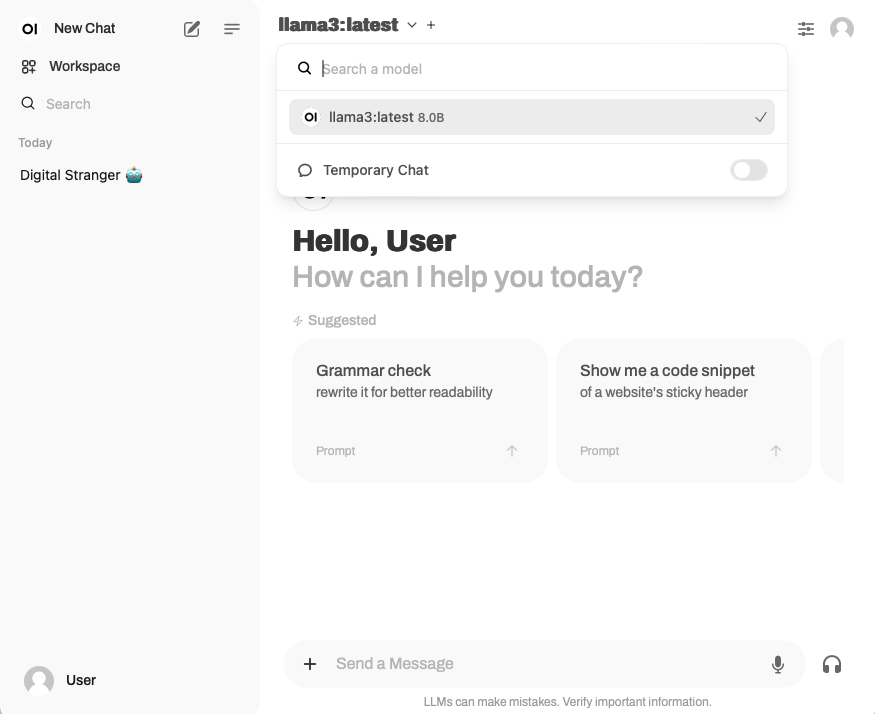

# OllamaGUI
Docker-based setup mixing Ollama and Open WebUI. This setup is recommended for lab use only, **DO NOT** use it in production!

This repository is heavily inspired by John Capobianco's series of [YouTube videos](https://www.youtube.com/@johncapobianco2527) and [GitHub repositories](https://github.com/automateyournetwork).

---

### Install
Prerequisites:
- Docker engine

```
$ docker pull ollama/ollama:latest

$ sudo mkdir /usr/share/ollama /usr/share/open-webui
```

---

### Run (manual)
```
$ docker run -d \
  -v /usr/share/ollama:/root/.ollama \
  -p 11434:11434 \
  --name ollama \
  ollama/ollama


$ docker exec -it ollama bash
root@0a438b17cc3b:/# ollama -v
ollama version is 0.3.9
```

**WARNING**: the next step is likely to require a long time, depending on your network speed.
```
root@0a438b17cc3b:/# ollama pull llama3
```

```
root@0a438b17cc3b:/# ollama list
NAME         	ID          	SIZE  	MODIFIED
llama3:latest	365c0bd3c000	4.7 GB	About a minute ago

root@0a438b17cc3b:/# ollama show llama3
  Model
  	arch            	llama
  	parameters      	8.0B
  	quantization    	Q4_0
  	context length  	8192
  	embedding length	4096

  Parameters
  	stop    	"<|start_header_id|>"
  	stop    	"<|end_header_id|>"
  	stop    	"<|eot_id|>"
  	num_keep	24

  License
  	META LLAMA 3 COMMUNITY LICENSE AGREEMENT
  	Meta Llama 3 Version Release Date: April 18, 2024
```

**NOTE**: to improve consistency and keep disk space utilization at a minimum, one location is recommended to hold all the model files. In this implementation the chosen location is `/usr/share/ollama/`. For instance:
```
$ ls -lh /usr/share/ollama/models/blobs
total 4.4G
-rw-r--r-- 1 root root  485 Sep  3 06:55 sha256-3f8eb4...
-rw-r--r-- 1 root root  13K Sep  3 06:55 sha256-4fa551...
-rw-r--r-- 1 root root  110 Sep  3 06:55 sha256-577073...
-rw-r--r-- 1 root root 4.4G Sep  3 06:55 sha256-6a0746..
-rw-r--r-- 1 root root  254 Sep  3 06:55 sha256-8ab484...
```
If Ollama is run from CLI, it is recommended to set `OLLAMA_MODELS` variable.


Ollama exposes an API on port 11434. The service can be reached externally (e.g. `0.0.0.0`) as such:
```
% curl http://<ip_address>:11434/api/generate -d '{"model": "llama3", "prompt": "Which is the Capital city of Italy?", "stream": false}'
{
  "model":"llama3",
  "created_at":"2024-09-03T06:05:53.997420619Z",
  "response":"The capital city of Italy is Rome (Italian: Roma).",
  "done":true,
  "done_reason":"stop",
  "context":[128006,882,128007,271,23956,374,279,18880,3363,...],
  "total_duration":30927400777,
  "load_duration":15572939780,
  "prompt_eval_count":18,
  "prompt_eval_duration":8153160000,
  "eval_count":13,
  "eval_duration":7142811000}%    
```

Before moving to the next step, terminate the container and clean up the environment:
```
$ docker container stop ollama

$ docker container rm $(docker container ls -aq -f "status=exited")
```

---

### Run (compose)
- Step 1: run the Ollama container in _standalone_ mode
```
$ docker compose -f dc1_standalone.yaml up
[+] Running 2/2
 ✔ Network ollamagui_default  Created       0.2s
 ✔ Container ollama           Created       0.1s
Attaching to ollama
...


$docker compose ls
NAME                STATUS              CONFIG FILES
ollamagui           running(1)          /home/toor/github/OllamaGUI/dc1_standalone.yaml


$ docker compose -f dc1_standalone.yaml ps
NAME      IMAGE           COMMAND               SERVICE   CREATED         STATUS         PORTS
ollama    ollama/ollama   "/bin/ollama serve"   ollama    2 minutes ago   Up 2 minutes   0.0.0.0:11434->11434/tcp, :::11434->11434/tcp
```

The container can still be accessed directly through its name, `docker exec`, or it can be accessed externally through its API. There's no difference in comparison with the previous "manual" approach.

To terminate the container, simply press `CTRL+C`. There is no need to remove the _exited_ containers.<br/>

- Step 2: run the Ollama and Open WebUI containers by means of Docker Compose
```
$ docker compose -f dc2_standalone.yaml up
```

This time, two separate containers will be spun up:
```
$ docker compose ls
NAME                STATUS              CONFIG FILES
ollamagui           running(2)          /home/toor/github/OllamaGUI/dc2_openwebui.yaml


$ docker compose -f dc2_openwebui.yaml ps
NAME         IMAGE                                COMMAND               SERVICE        CREATED          STATUS                             PORTS
ollama       ollama/ollama                        "/bin/ollama serve"   ollama         23 seconds ago   Up 22 seconds                      0.0.0.0:11434->11434/tcp, :::11434->11434/tcp
open-webui   ghcr.io/open-webui/open-webui:main   "bash start.sh"       ollama-webui   23 seconds ago   Up 22 seconds (health: starting)   0.0.0.0:8090->8080/tcp, :::8090->8080/tcp
```

Finally, access the GUI through `http://<ip_address>:8090/`, authentication is not required (hint: see `WEBUI_AUTH=False` in `dc2_openwebui.yaml`)<br/>



